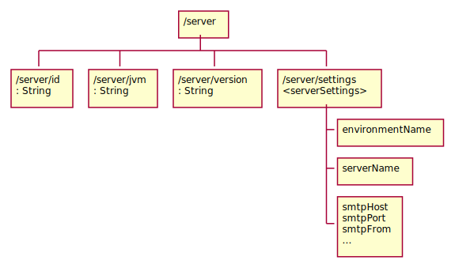
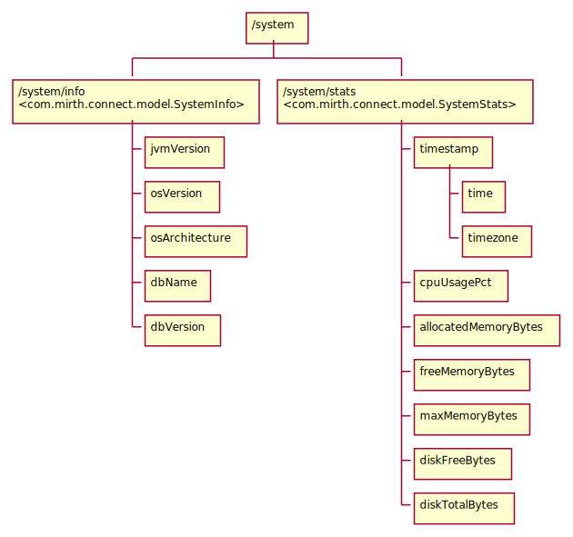

= Mirth API

----
class Server < ApplicationRecord
  # properties: jsonb
  # self[:uid] = properties['server_uid']

  store_accessors :properties, :server_uid
  store_accessors :properties, :server_jvm
  store_accessors :properties, :server_version
  store_accessors :properties, :server_settings
  store_accessors :properties, :system_info
end
----

== Server

.Information from /server tree

.Information from /system tree

== Channel

----
class Channel < ApplicationRecord
  # properties: jsonb
  # self[:uid] = properties['id']

  store_accessors :properties, :channel_uid
  store_accessors :properties, :name
  store_accessors :properties, :description
  store_accessors :properties, :revision
end
----
